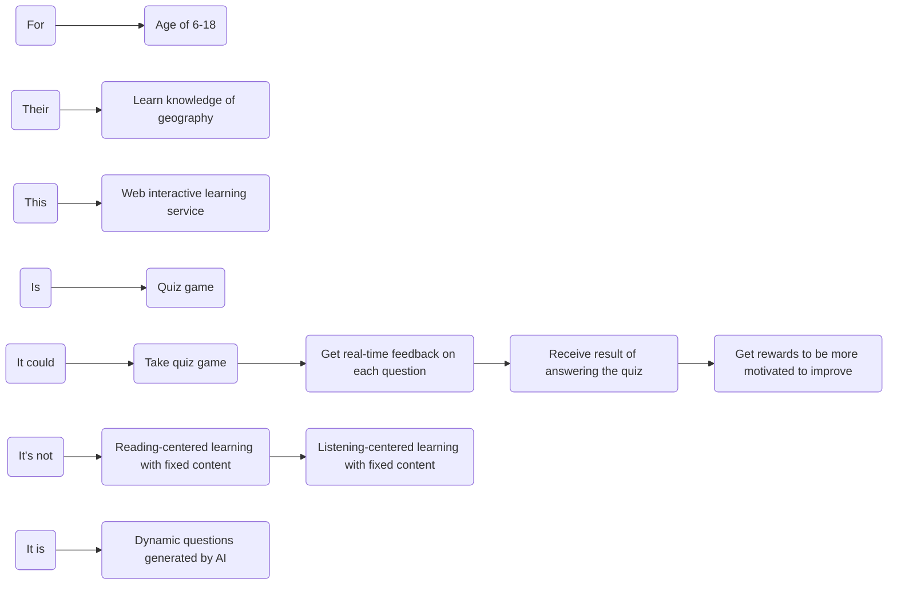
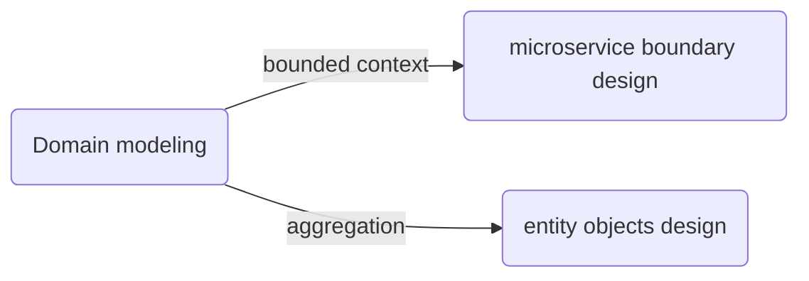
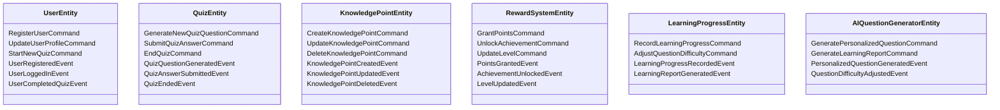
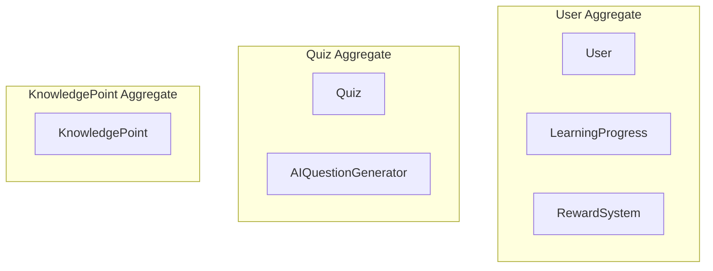
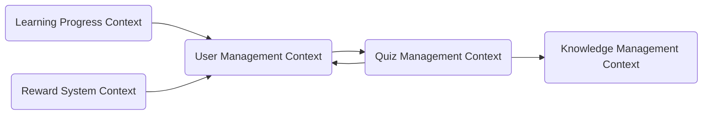
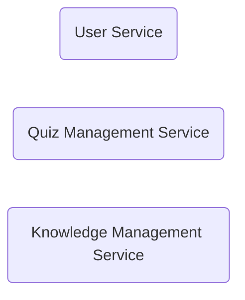
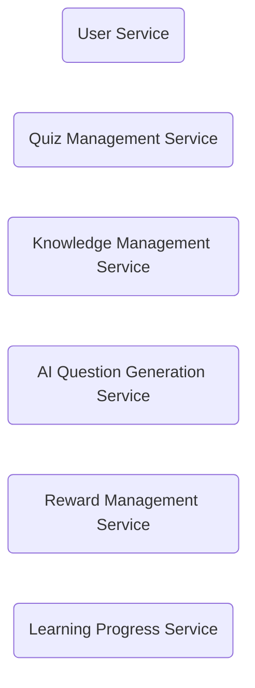

## Product Basic Information

To build an online interactive learning service to help users learn happily.

Detail user stories are:

- User could explore learning topics.
- User could take quiz game to test their knowledge and learn new knowledge.
- User could get real-time feedback on each question.
- User could receive result of answering the quiz.
- User could get rewards to be more motivated to improve.
- User could get recommend of new topics or quizzes based on the learning history and areas of weakness.
- User could revisiting past quizzes.

## Strategic Design

Strategic design is the process of

- Identifying **domain objects** and aggregate **roots** based on **user journey** analysis
- Clustering **entities** and **value objects** into aggregates
- Dividing **bounded contexts**
- Establishing **domain models**

The way to do the strategic design is **event storming**, it includes:

- Product Vision
- Scenario Analysis
- Domain Modeling
- Microservices Splitting

Who should join the Strategic design?

- domain experts
- business requirement side member
- product manager
- architect
- project manager
- development manager
- test manager

### 1.Product Vision

Product vision is the top-level value design of the product, which reaches consensus on information:

- the product's target users
- core values
- differentiated competitive points

to prevent the product from deviating from its direction.

During the event storming, all participants write their opinions on each key point on stickers and stick them on the whiteboard. The event storming host will discuss each sticker and converge and unify the divergent opinions to form **the product vision map** below.

<!-- mermaid -->

<!-- mermaid -->

Organized above info into **a paragraph**:

We build a web interactive learning service to help the 6-18 years old users learn knowledge of geography by quiz game. It's not like traditional reading-centered or listening-centered learning way with fixed content, it provides dynamic questions generated by AI.

Product vision analysis is valuable for startup systems to clarify system building priorities, unify team building goals and establish a common language. However, if your system goals and requirements are very clear, this step can be ignored.

### 2.Scenario Analysis

Scenario analysis starts from the user's perspective, explores typical scenarios in the business domain, and produces **scenario classifications**, **use case operations**, and **dependencies between different subdomains that need to be supported in the domain** to support domain modeling.

Project team members **use event storming to analyze the user journey**. According to the journey and scenario analysis of different roles, all operations, commands, domain events, external dependencies and other information from front-end operations to back-end business logic are sorted out as comprehensively as possible.

**Scenario 1 User Begins Learning**

**Scenario 2 User Completes a Quiz and Receives Feedback**

About the difference between events and commands, please check
[Events vs Commands, What's the Difference?](/blog/posts/2023-10-18-events-vs-commands)

### 3.Domain Modeling

Domain modeling is to establish domain models by analyzing the business and issue domain.

It guides the microservice boundary design through **bounded context** upwards and guides the entity objects design through **aggregation** downwards.

<!-- mermaid -->

<!-- mermaid -->

Domain modeling is **a convergent process**, divided into 3 steps:

**Step1: Find out the domain objects such as entities and value objects.**

Based on the scenario analysis, analyze and find out the entities and value objects that initiate or generate these commands or domain events. Aggregate the commands and events related to entities or value objects to the entities.

<!-- mermaid -->

<!-- mermaid -->

Now we got:

- **User Entity**
- **Quiz Entity**
- **KnowledgePoint Entity**
- **RewardSystem Entity**
- **LearningProgress Entity**
- **AIQuestionGenerator Entity**

By aggregating commands and domain events into entities and value objects, we are able to specify the responsibilities and behavior of each domain model in the system.
In a microservices architecture, this aggregation also helps us to design the core functionality of each microservice and define how services interact with each other.

**Step2: Define Aggregates**

let's first find the aggregate roots.An aggregate root is an entity that:

- Controls access to the aggregate (group of entities or value objects).
- Ensures consistency within its boundary by enforcing invariants (business rules).
- Is responsible for coordinating its inner entities or value objects.
- Acts as the entry point for modifications to the aggregate.

In our case:

<!-- mermaid -->

<!-- mermaid -->

By organizing entities in this way, we reduce complexity and maintain clear boundaries between aggregates. Each aggregate root governs its own consistency and business logic, while interactions between aggregates are kept minimal.

**Step3: Define the Bounded Context**

Each Bounded Context acts **independently**, **allowing teams to work on different parts of the system at same time** with clarity and minimal interference.

In our case, the bounded Contexts and the relationship between them would be:

<!-- mermaid -->

<!-- mermaid -->

### 4.Microservices Splitting

Key Considerations for Microservice Splitting:

- Bounded Contexts: Each microservice should map to a specific bounded context (a distinct area of the domain with its own language and rules).
- Single Responsibility: Each service should be responsible for a single business capability or closely related group of capabilities.
- Autonomy: Each microservice should manage its own data and operate independently of other services as much as possible.
- Loose Coupling: Communication between microservices should happen through APIs or messaging, without tight dependencies.
- High Cohesion: Services should group functionalities that are closely related within the same domain context.

Theoretically, **a bounded context can be designed as a microservice**, but it is also necessary to consider a variety of external factors.For now, Let's divide microservices mainly considering the principle of **single responsibility**.

The smaller the microservice split, the more complex the calls between microservices become and the more difficult they are to develop.

So at the beginning of our project, we started with only three microservices.

<!-- mermaid -->

<!-- mermaid -->

Not we just plan to do a interactive learning geography knowledge product.
But when we want to go **from a single product to multiple products**, for example:

- Interactive voice learning products for 3-6 years old
- Interactive learning history knowledge product
- Financial Literacy Learning Products for 18+ years old
- ....

The current 3 microservices are clearly not scalable, and we can split the microservices more uncoupled.

<!-- mermaid -->

<!-- mermaid -->

## Summary

At this point, the strategic design is over. Through strategic design, we have established domain models and divided the microservice boundaries.

DDD Strategic design starts with event storming, then we have to find out the domain objects such as entities, find out the aggregate roots to build aggregates, divide the bounded contexts and establish the domain models.

The next step is tactical design, which is also microservice design. Let's take the **AI Question Generation microservice** as an example to explain its design process.

## Related Stories

[DDD1: Getting to Know Domain-Driven Design](/blog/posts/2024-08-29-DDD1)

[DDD2: Strategic Design of DDD](/blog/posts/2024-10-19-DDD2)

[DDD3: Tactical Design of DDD](/blog/posts/2024-10-31-DDD3)

## References

https://zq99299.github.io/note-book2/ddd/

https://github.com/yingfeidai/design-insights/blob/main/scalable-modular-architecture/README.zh.md
