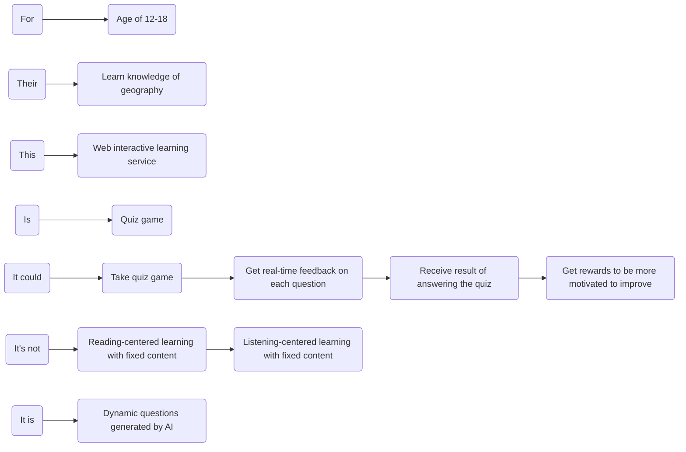

## Product Basic Information

To build a online interactive learning service to help users learn happily.

Detail user stories are:

- User could explore learning topics.
- User could take quiz game to test their knowledge and learn new knowledge.
- User could get real-time feedback on each question.
- User could receive result of answering the quiz.
- User could get rewards to be more motivated to improve.
- User could get recommend of new topics or quizzes based on the learning history and areas of weakness.
- User could revisiting past quizzes.

## Strategic Design

Strategic design is the process of

- Identifying **domain objects** and aggregate **roots** based on **user journey** analysis
- Clustering **entities** and **value objects** into aggregates
- Dividing **bounded contexts**
- Establishing **domain models**

The way to do the strategic design is **event storming**, it includes:

- product vision
- scenario analysis
- domain Modeling
- microservices Splitting

Who should join the Strategic design?

- domain experts
- business requirement side member
- product manager
- architect
- project manager
- development manager
- test manager

### 1.Product Vision

Product vision is the top-level value design of the product, which reaches consensus on information:

- the product's target users
- core values
- differentiated competitive points

to prevent the product from deviating from its direction.

During the event storming, all participants write their opinions on each key point on stickers and stick them on the whiteboard. The event storming host will discuss each sticker and converge and unify the divergent opinions to form **the product vision map** below.

<!-- mermaid -->

<!-- mermaid -->

Organized above info into **a paragraph**:

We build a web interactive learning service to help the 12-18 years old users learn knowledge of geography by quiz game. It's not like traditional reading-centered or listening-centered learning way with fixed content, it provides dynamic questions generated by AI.

Product vision analysis is valuable for startup systems to clarify system building priorities, unify team building goals and establish a common language. However, if your system goals and requirements are very clear, this step can be ignored.

### 2.Scenario Analysis

Scenario analysis starts from the user's perspective, explores typical scenarios in the business domain, and produces **scenario classifications**, **use case operations**, and **dependencies between different subdomains that need to be supported in the domain** to support domain modeling.

Project team members **use event storming to analyze the user journey**. According to the journey and scenario analysis of different roles, all operations, commands, domain events, external dependencies and other information from front-end operations to back-end business logic are sorted out as comprehensively as possible.

**Scenario 1 User Begins Learning**

**Scenario 2 User Completes a Quiz and Receives Feedback**

### 3.Domain Modeling

### 4.Microservices Splitting

## Tactical Design

### 1.Analyze Domain Objects of Microservices

### 2.Design Code Structure of Microservices

## Other tasks

Design the microservices in detail:

- All the entities and entities events
- Database
- Entities and database mapping
- Service parameter specifications
- Function implementation

https://github.com/zhumeisongsong/time-travels-workspace

## Summary

DDD Strategic design starts with event storming, then we have to find out the domain objects such as entities, find out the aggregation root to build the aggregation, delineate the bounded context and build the domain models.

Tactical design starts with the commands of event storming, identifying and designing services, establishing dependencies of services at each layer, designing entities and value objects within the microservices, identifying all domain objects in the microservices, and establishing the mapping relationship between domain objects and code objects.

This will be a good way to guide the product development and testing.

## References

https://zq99299.github.io/note-book2/ddd/
