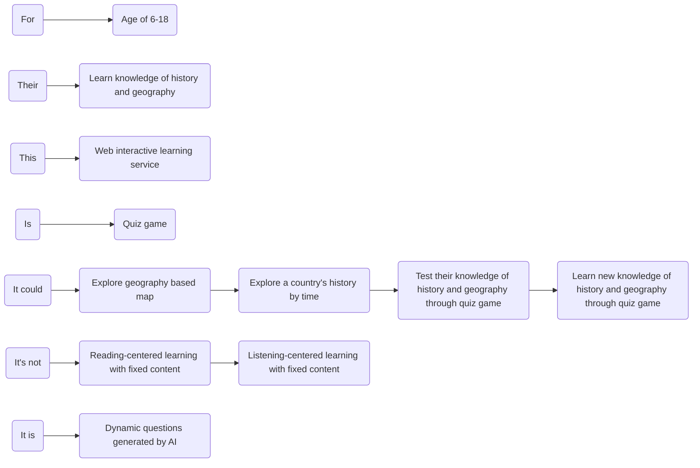

## Product Basic Information

To build a web service for learning knowledge of history and geography.

Detail user stories are:

- User could explore geography based map.
- User could select a country and explore history of it by time.
- User could test their knowledge of history and geography through quiz game.
- User could learn new knowledge of history and geography through quiz game.
- User could get rewards for completing the quiz game.

## Strategic Design

Strategic design is the process of

- Identifying **domain objects** and aggregate **roots** based on **user journey** analysis
- Clustering **entities** and **value objects** into aggregates
- Dividing **bounded contexts**
- Establishing **domain models**

The way to do the strategic design is **event storming**, it includes:

- product vision
- scenario analysis
- domain Modeling
- microservices Splitting

Who should join the Strategic design?

- domain experts
- business requirement side member
- product manager
- architect
- project manager
- development manager
- test manager

### Product Vision

Product vision is the top-level value design of the product, which reaches consensus on information:

- the product's target users
- core values
- differentiated competitive points

to prevent the product from deviating from its direction.

During the event storming, all participants write their opinions on each key point on stickers and stick them on the whiteboard. The event storming host will discuss each sticker and converge and unify the divergent opinions to form **the product vision map** below.

 <!--mermaid-->

<!--mermaid-->

Organized above info into a paragraph:

We build a web interactive learning service to help the 6-18 years old users learn knowledge of history and geography by quiz game. It's not like traditional reading-centered or listening-centered learning way with fixed content, it provides dynamic questions generated by AI.

Product vision analysis is valuable for startup systems to clarify system building priorities, unify team building goals and establish a common language. However, if your system goals and requirements are very clear, this step can be ignored.

### Scenario Analysis

### Domain Modeling

### Microservices Splitting

## Tactical Design

### Analyze Domain Objects of Microservices

### Design Code Structure of Microservices

## Other tasks

Design the microservices in detail:

- All the entities and entities events
- Database
- Entities and database mapping
- Service parameter specifications
- Function implementation

## Summary

For building a **Historical Geography Quiz Game**:

## References

https://zq99299.github.io/note-book2/ddd/
