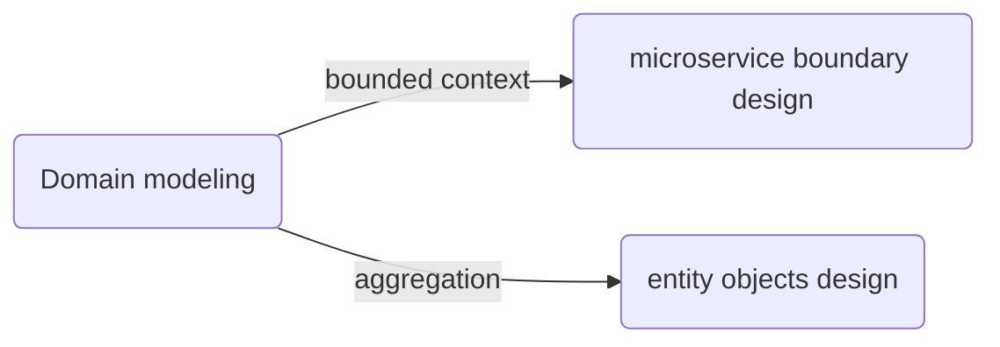
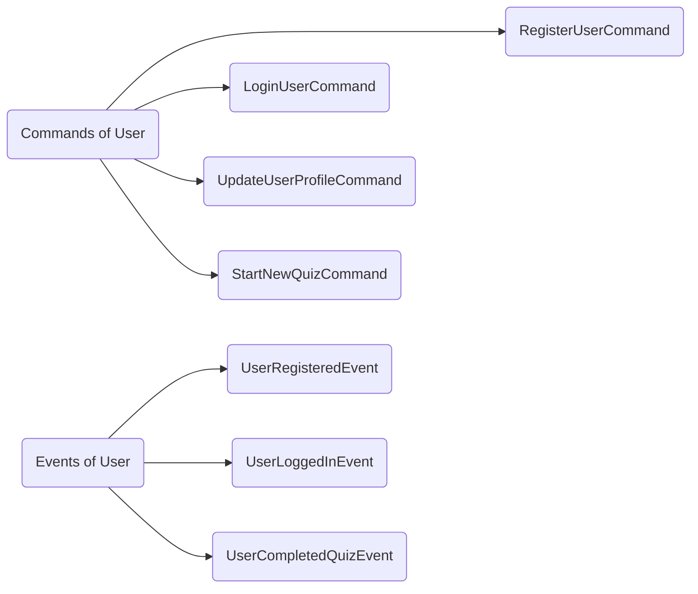
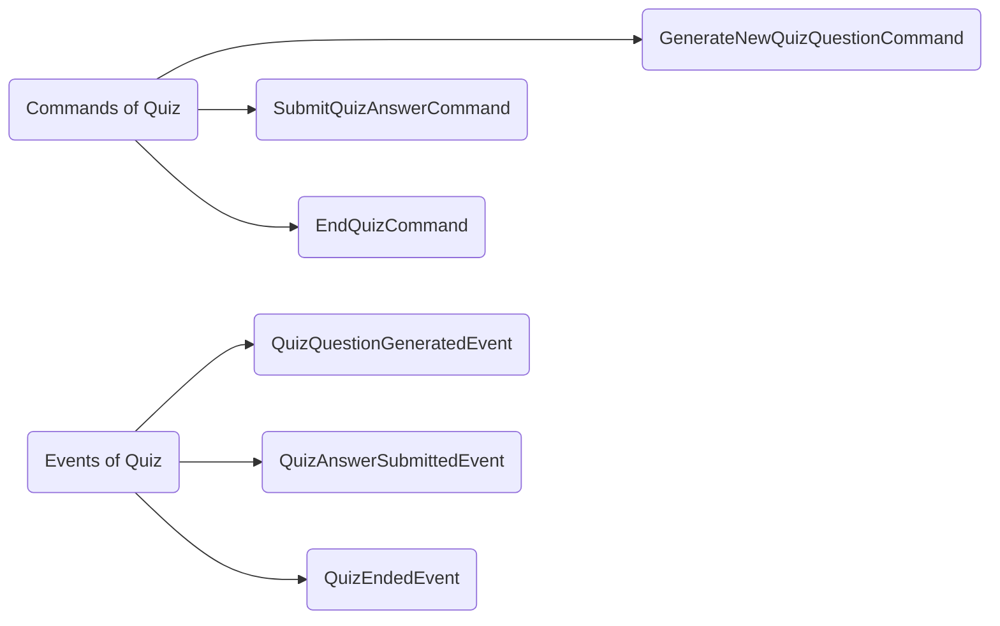
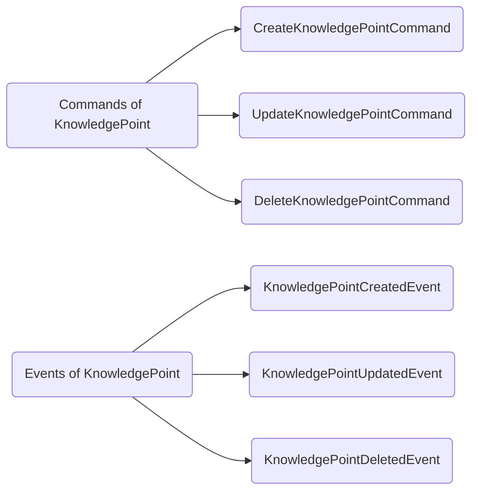
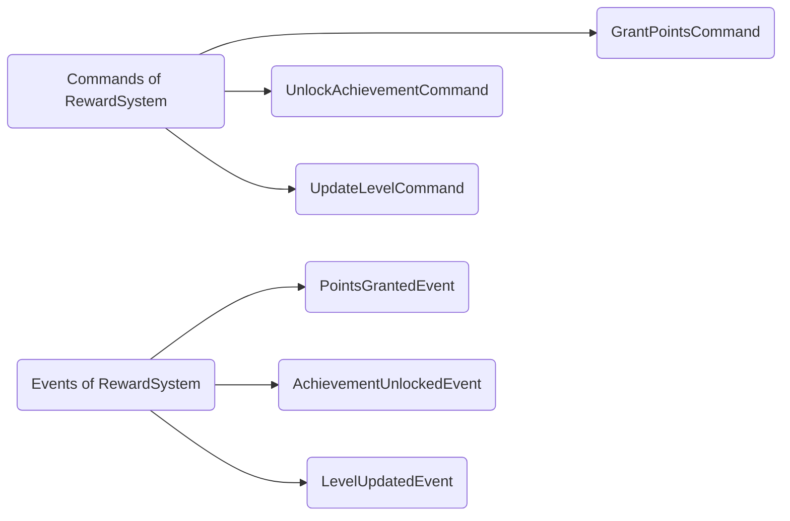
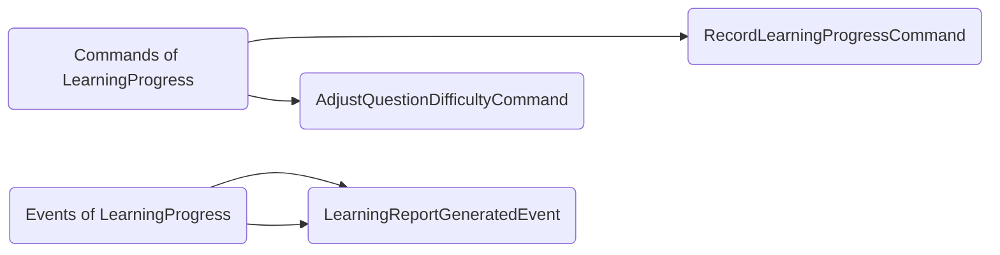
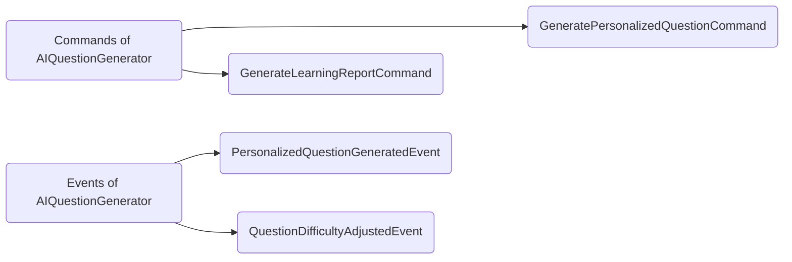
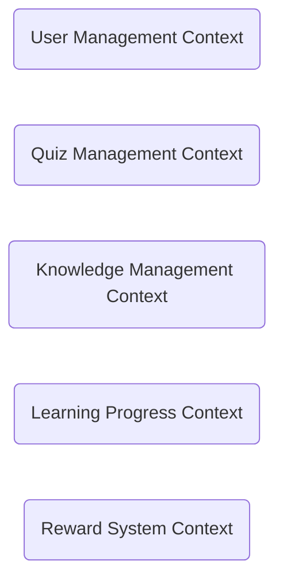

## Product Basic Information

To build a online interactive learning service to help users learn happily.

Detail user stories are:

- User could explore learning topics.
- User could take quiz game to test their knowledge and learn new knowledge.
- User could get real-time feedback on each question.
- User could receive result of answering the quiz.
- User could get rewards to be more motivated to improve.
- User could get recommend of new topics or quizzes based on the learning history and areas of weakness.
- User could revisiting past quizzes.

## Strategic Design

Strategic design is the process of

- Identifying **domain objects** and aggregate **roots** based on **user journey** analysis
- Clustering **entities** and **value objects** into aggregates
- Dividing **bounded contexts**
- Establishing **domain models**

The way to do the strategic design is **event storming**, it includes:

- product vision
- scenario analysis
- domain Modeling
- microservices Splitting

Who should join the Strategic design?

- domain experts
- business requirement side member
- product manager
- architect
- project manager
- development manager
- test manager

### 1.Product Vision

Product vision is the top-level value design of the product, which reaches consensus on information:

- the product's target users
- core values
- differentiated competitive points

to prevent the product from deviating from its direction.

During the event storming, all participants write their opinions on each key point on stickers and stick them on the whiteboard. The event storming host will discuss each sticker and converge and unify the divergent opinions to form **the product vision map** below.

<!-- mermaid -->

<!-- mermaid -->

Organized above info into **a paragraph**:

We build a web interactive learning service to help the 6-18 years old users learn knowledge of geography by quiz game. It's not like traditional reading-centered or listening-centered learning way with fixed content, it provides dynamic questions generated by AI.

Product vision analysis is valuable for startup systems to clarify system building priorities, unify team building goals and establish a common language. However, if your system goals and requirements are very clear, this step can be ignored.

### 2.Scenario Analysis

Scenario analysis starts from the user's perspective, explores typical scenarios in the business domain, and produces **scenario classifications**, **use case operations**, and **dependencies between different subdomains that need to be supported in the domain** to support domain modeling.

Project team members **use event storming to analyze the user journey**. According to the journey and scenario analysis of different roles, all operations, commands, domain events, external dependencies and other information from front-end operations to back-end business logic are sorted out as comprehensively as possible.

**Scenario 1 User Begins Learning**

**Scenario 2 User Completes a Quiz and Receives Feedback**

### 3.Domain Modeling

Domain modeling is to establish a domain model by analyzing the business and issue domain.

It guides the microservice boundary design through **bounded context** upwards and guides the entity objects design through **aggregation** downwards.

<!-- mermaid -->

<!-- mermaid -->

Domain modeling is a convergent process, divided into 3 steps:

Step1: Find out the domain objects such as entities and value objects.

Based on the scenario analysis, analyze and find out the entities and value objects that initiate or generate these commands or domain events. Aggregate the commands and events related to entities or value objects to the entities.

:sparkles: User entity

<!-- mermaid -->

<!-- mermaid -->

:sparkles: Quiz entity

<!-- mermaid -->

<!-- mermaid -->

:sparkles: KnowledgePoint entity

<!-- mermaid -->

<!-- mermaid -->

:sparkles: RewardSystem entity

<!-- mermaid -->

<!-- mermaid -->

:sparkles: LearningProgress entity

<!-- mermaid -->

<!-- mermaid -->

:sparkles: AIQuestionGenerator entity

<!-- mermaid -->

<!-- mermaid -->

Step2: Define the aggregation

User Aggregate

Quiz Aggregate

Knowledge Aggregate

Learning Progress Aggregate

Reward System Aggregate

Step3: Define the Bounded Context

<!-- mermaid -->

<!-- mermaid -->

### 4.Microservices Splitting

Theoretically, a bounded context can be designed as a microservice, but it is also necessary to consider a variety of external factors, such as: 
- single responsibility
- separation of agile and stable business
- non-functional requirements (such as elastic scaling, version release frequency and security requirements)
- software package size
- team communication efficiency 
- technical heterogeneity
- other non-business factors.

For now, Let's divide microservices mainly considering the principle of single responsibility. 

At this point, the strategic design is over. Through strategic design, we have established domain models and divided the microservice boundaries.

The next step is tactical design, which is also microservice design. Let's take the **quiz generated micro service** as an example to explain its design process.

## Summary

DDD Strategic design starts with event storming, then we have to find out the domain objects such as entities, find out the aggregation root to build the aggregation, delineate the bounded context and build the domain models.

## References

https://zq99299.github.io/note-book2/ddd/
